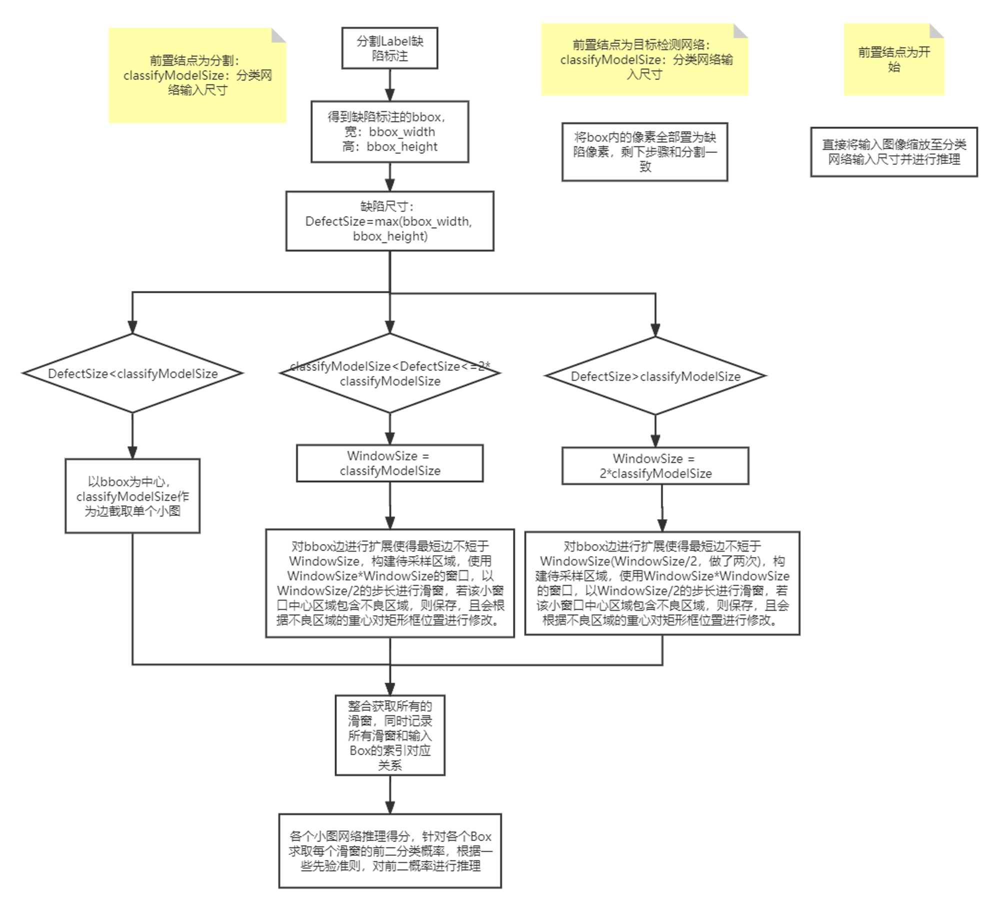
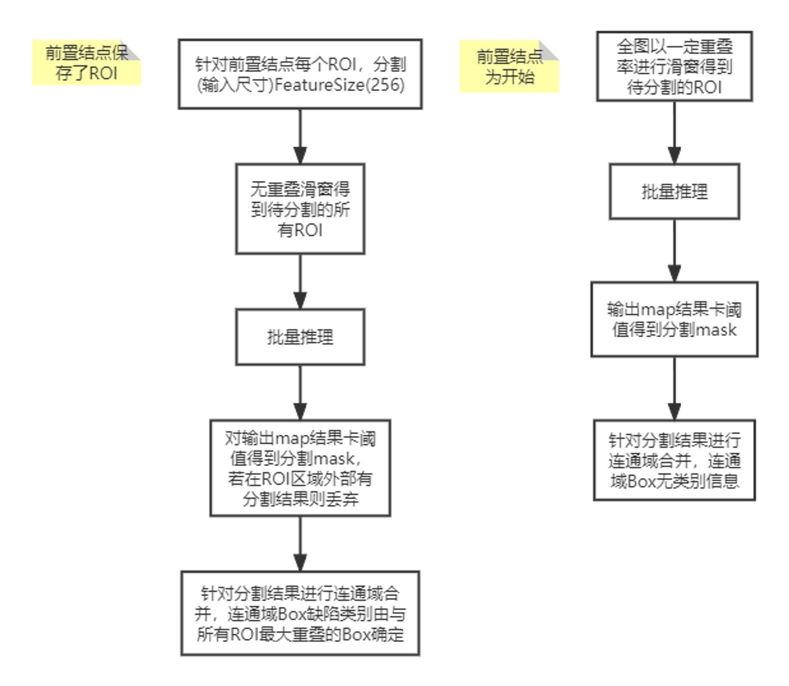
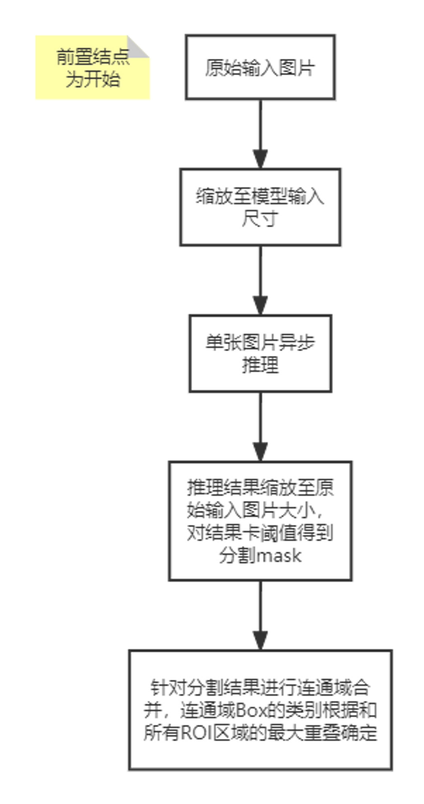
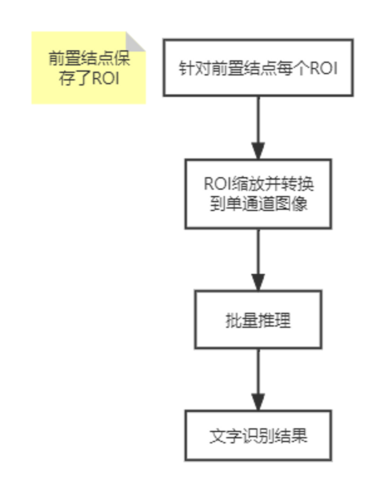
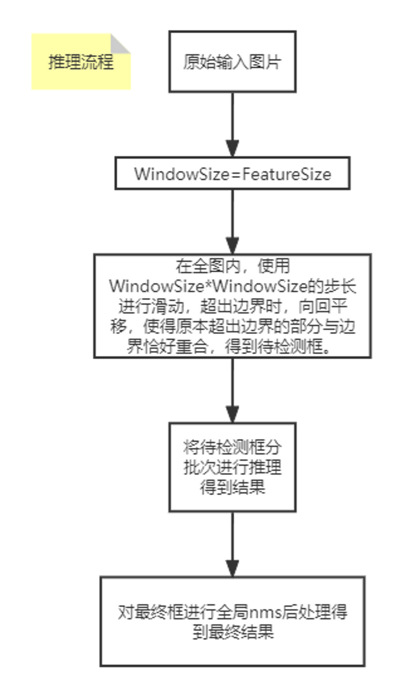

# 模型流插件代码架构开发文档

[TOC]


## 一、数据对象

> <a href="#IFSDataObject">*IFSDataObject (Base Class)*</a>
>
> > <a href="#IFSControls">**IFSControls**</a>
> >
> > <a href="#IFSDefect">**IFSDefect**</a>
> >
> > <a href="#IFSImage"><font color=red>**IFSImage**</font></a>
> >
> > <a href="#IFSNetParamsGlobal"><font color=orange>**IFSNetParamsGlobal**</font></a>
> >
> > <a href="#IFSNetParamsIn"><font color=orange>**IFSNetParamsIn**</font></a>
> >
> > <a href="#IFSNetParamsOut"><font color=orange>**IFSNetParamsOut**</font></a>


### 1、IFSDataObject(数据基础类)

<span id="IFSDataObject"></span>

```c++
class IFS_PROPERTY_EXPORT  IFSDataObject
		{
		public:
			IFSDataObject() { _type = IFS_UNDEFINED; }
			IFSDataObject(IFSDataType type) { _type = type; } 
			virtual             ~IFSDataObject() {} 		 
			virtual IFSDataObject* clone();
			IFSDataObject(const IFSDataObject& obj);  

			virtual IFSDataObject& operator=(const IFSDataObject& obj); 
			virtual bool operator==(const IFSDataObject& obj) const;
			virtual bool operator!=(const IFSDataObject& obj) const;

		protected:
			IFSDataType         _type;
		};

enum IFSDataType
		{
			IFS_IMAGE_BW = 0,		//
			IFS_IMAGE_GRAYSCALE,	//灰度图
			IFS_IMAGE_COLOR,		  //颜色，彩色
			IFS_IMAGE_ORIENTED,		//自适应图
			IFS_IMAGE_COMPLEX,		//复杂的图
			IFS_POINT,				    //点集合
			IFS_MATRIX,				    //矩阵
			IFS_SHAPES,				    //形状
			IFS_UNDEFINED,			  //未定义
			IFS_CONTROLS,			    //控制点 
			IFS_KEYPOINTS,			  //关键点
			IFS_CV_MAT,				    //cv mat 数据
			IFS_CV_GPUMAT,			  //cv gpumat 数据
			IFS_VECTOR,				    //vector 
			IFS_NUM_DATATYPES		  //数字型数据
		};
```

说明：IFSDataObject是所有数据相关的基类，只有一个成员变量，为枚举类型， 用于表明当前的数据类型，可取的值如右边代码所示。

文件位置:  `$(SourceProject)\FSAI_Core_Property\inc\IFSDataObject.h`

### 2、IFSControls

<span id="IFSControls"></span>

```c++
class IFS_PROPERTY_EXPORT IFSControls : public IFSDataObject
		{
		public:
			IFSControls();
			IFSControls(int level
				, double levelThreshold
				, double area_min
				, double area_max
				, bool enable
				, std::string colour
				, std::string name
			);

			IFSControls(const IFSControls& other);
			IFSControls& operator=(const IFSControls& other);
			~IFSControls();
			/*
			set/get series for each attribute
			*/
			std::string toString(int x, int y);
		private:
			int m_level;                //缺陷等级
			double m_level_threshold;   //等级过滤
			bool m_enable;             // 使能
			double m_area_min;
			double m_area_max;
			std::string  m_colour;      //标签
			std::string  m_name;        //标签

		};
```

说明：描述缺陷种类，缺陷等级；

文件位置：`$(SourceProject)\FSAI_Core_Property\inc\IFSControls.h`

### 3、<span id="IFSDefect">IFSDefect</span>

<span id="IFSDefect"></span>

```C++
class IFSSHARED_EXPORT IFSDefect :public IFSDataObject
		{
		public:
			IFSDefect();
			virtual             ~IFSDefect() {}
			virtual IFSDefect& operator=(const IFSDefect& obj);
			virtual bool operator==(const IFSDefect& obj) const;
			virtual bool operator!=(const IFSDefect& obj) const;
			virtual IFSDefect*	clone();

			/*
			set/get series.
			*/
		protected:
			int							m_fsIdx;     // 序号 region ID
			bool						m_isValid;	 // 标签是否有效，过滤项，此为false	
			cv::Rect					m_fsBbox;				// 外接矩形缺陷			  |检测+分类信息 
			std::vector<cv::Point> m_rotate_point;// 旋转框的顶点
			cv::Mat						m_fsDefectData;			// 缺陷数据像素点  |检测+分类信息
			float						m_angle;				//角度
			int							m_fsDefectNum;  //缺陷数据像素点个数，是一个轮廓部分点集
			int							m_fsArea;				//缺陷面积 新增加，用于反馈 缺陷面积，和 defect_pixel_num 区别
			int							m_fsClassifyIdx;		// 分类类别id		
			float						m_fsClassifyScore;	// 分类得分	 
			int							m_fsClassifyIdx2;		// 分类类别id2		
			float						m_fsClassifyScore2; // 分类得分2  
			std::string					m_str01;				//string 01  ocr
			std::string					m_str02;				//string 02  ocr
		};
```

说明：缺陷区域描述类，包括区域序号ID，缺陷矩阵，分类类别，得分等信息…

文件位置：`$(SourceProject)\FSAI_Core_ProccessV2\core\inc\IFSDefect.h`

### 4、<span id="IFSImage">IFSImage</span>

<span id="IFSImage"></span>

```c++
class IFSSHARED_EXPORT IFSImage : public IFSData
		{
		public:
			IFSImage();
			IFSImage(const IFSImage& image);
			IFSImage(IFSDataType _type, int width, int height);
			IFSImage(cv::Mat& cvMat);

			virtual IFSImage& operator=(const IFSImage& obj);
			virtual bool operator==(const IFSImage& obj) const;
			virtual bool operator!=(const IFSImage& obj) const;

			~IFSImage();
			void init();

			//==================current base===================================// 
			void						ReadChannel(int rf);                   // 设置读取图的彩色，灰度
			int							readChannel();                         // 读取图像通道数
			int							channel(void) { return _nrOfPlanes; }
			int							width(void) { return _width; }
			int							height(void) { return _height; } 
			cv::Mat&			  plane(int planeNr);                    // 获取某一通道图像
			float*					plane(int x, int y);
			std::string     toString(int x, int y); 
			void						reserveSrcGmat(int s);                 // 创建s个的cv::cuda:GpuImage并且保存入_srcGpuList

		
			//==================current in ===================================// 
			void						toCvMat(cv::Mat &src);                               // 获取cv::Mat,并且写入 _mat 属性成员中
			void						toCvMat(FS_SHAREPTR<std::vector<cv::Mat>> &srclist); // 获取 cv::Mat 的向量集合到 _matlist
			FS_SHAREPTR< std::vector<cv::Mat>>  toMatSrclist();                  // 获取 _matlist

			cv::Mat                     toCvMat(cv::Rect roi= cv::Rect(0, 0, 0, 0));                              // 获取对应ROI区域的_mat
			cv::cuda::GpuMat            toGpuMat(int idx = 0, cv::Rect roi = cv::Rect(0, 0, 0, 0), int chn = -1); // 获取对应索引cv::cuda::GpuMat的ROI区域
			cv::cuda::GpuMat            toResizeGpuMat(int idx , cv::Size size); // 对srcGpuMat中对应索引位置出的GpuMat惊醒resize操作

			cv::Rect					getSrcGpuRoi(int idx = 0);        // 回去对应索引的GpuMat的全局ROI区域
			cv::Rect					getOriginalRoi();                 // 返回 _oldRoi                      
			cv::Rect					getSrcGpuNoPaddRoi(int idx = 0);  // 返回没有padding的GpuMat ROI
			int							  upload(cv::Rect roi = cv::Rect(0, 0, 0, 0)); // 以_mat中的对象作为原图进行不同尺度缩放之后上传到 _srcGpuList 向量中
			
			//==================current out ===================================// 
			cv::Mat                     toRsMat();  // 获取分割结果 _resultmat
			void					              toRsMat(cv::Mat &src);  // 获取分割结果
			cv::cuda::GpuMat            toRsGpuMat(cv::Rect roi = cv::Rect(0, 0, 0, 0)); // 返回对应ROI区域的分割结果
			void						download(cv::Rect roi = cv::Rect(0, 0, 0, 0)); // 将_resulgpumat(GpuMat) 下载到 _resultmat 

			//==================current ROI===================================// 
			void						addROI(cv::Rect & roi);  // ROI系列操作，一般于目标检测中添加ROI，其他分类、分割模块的利用ROI区域进行推理
			void						addROI(FS_SHAREPTR<std::vector<cv::Rect>> & roiv); 
			FS_SHAREPTR< std::vector<cv::Rect>> matROI(); 
	
			void						resetROI(); //重置ROI
			void						resetAllMat(); //重置mat 数据
			void						releaseAllMat(); //释放mat 数据
			   

			//==================gloabl ROI/mask/padding====================// 
			cv::Rect				GlobalRoi() const { return _globalRoi; }
			void						SetGlobalRoi(cv::Rect val) { _globalRoi = val; }
			cv::Mat					GlobalMask() const { return _globalMask; }
			void						SetGlobalMask(cv::Mat val) { _globalMask = val; }
			FSAI::MS::IFSPadding_st		GlobalPadding() const { return _globalPadding; }
			void						SetGlobalPadding(FSAI::MS::IFSPadding_st& val);

			  

			//设置属性
			IFSPropData*		getProperty(std::string key); // 获取类中的属性
			std::string			getPropertyString(std::string key);
			int							getPropertyInt(std::string key);
			double					getPropertyDouble(std::string key);
			void						setProperty(std::string key, IFSPropData* value);
			void						setProperty(std::string key, std::string value);

		

			//缺陷结果返回   
			void						rsStatus(IFS_RS rs) { _rsStatus = rs; }
			IFS_RS					rsStatus() { return _rsStatus; }
			int							checkGPUStatus();          // 返回值为GPU的数量，若为0或小于0 未找到GPU;
			IFSProcess*			GetProcess();              // 模型流设置的结点;
			void						SetProcess(IFSProcess* p); // 设置模型流结点
			uchar*					rgb32(void);
			void						setCurrNodeDefect(FS_SHAREPTR <IFSNetParmsOut> & val); // 设置Image当前的节点类
			IFSNetParmsOut*				rsCurrNodeDefects_Ptr();   // 获取结点类;
			FS_SHAREPTR<IFSNetParmsOut> rsCurrNodeDefects(); // 获取结点；

			void            setDefectMap(std::string node_name, FS_SHAREPTR<IFSNetParmsOut> node_defect);
			void            clearDefectMap() { _rsDefectMap->clear(); }
			FS_SHAREPTR<std::map<std::string, FS_SHAREPTR<IFSNetParmsOut>>> getDefectMap() { return _rsDefectMap; }

			FSAI::MS::FSDEVICETYPE Device_mod() const { return _device_mod; }
			void SetDevice_mod(FSAI::MS::FSDEVICETYPE val) { _device_mod = val; }

		private:

#ifdef USE_GPU_FS
			cv::cuda::GpuMat	fnGetSrcGpuMat(int idx, cv::Rect roi = cv::Rect(0,0,0,0)); // 获取cv::cuda::GpuMat对应区域的对象		
			void						fnScalePaddSrcGpuMat(int idx); // 目前已弃用;
			void						fnScalePaddSrcCpuMat(int idx); // 将cv::Mat对象进行缩放，上传到_srcGpuMatList内的对应索引GpuMat上
			void						GetPaddingGPU(cv::cuda::GpuMat& srcImgTmp, cv::cuda::GpuMat& dstImg,  int paddsize,  int type );
			void						GetPaddingCpu2GPU(cv::Mat& srcImg, cv::cuda::GpuMat& srcImgTmp, cv::cuda::GpuMat& dstImg, int paddsize, int type);   // 将CPU Image上传到 GPU Mat上
			void						GetGpuMat(cv::cuda::GpuMat & src, cv::Rect & roi, int type, bool reset = false);  // 判断ROI区域和GpuMat大小，若GpuMat尺寸小于ROI，会重新创建一个更大的 GpuMat，并返回相应矩形区域
#endif
			 
			void						GetCpuMat(cv::Mat & src, cv::Rect & roi, int type, int initValue = 0, bool reset = false); // 同上GPUMat区域
			void						AdjustRectPos(cv::Rect& Rect, const cv::Rect& RegionRect);                        // 以第二个区域为标准对第一个rect区域进行修正
			void						AdjustRectInterSetion(cv::Rect& Rect, const cv::Rect& RegionRect); //求取交集
		private:
			// --------------global input base info ------------------- //
			int               _width;
			int               _height;
			int               _nrOfPlanes;
			int							  _readChanl;			//读取图的通道 
			int							  _reservecap;		// 保存的GPUMat的个数
			uchar*				    _rgb32;
			static int        _instanceCount; // Image实例 计数静态变量
			FSDEVICETYPE			_device_mod;		// 推理卡类型
			int							  _isGPu;				  // 设备个数 
			cv::Mat						_mat;				    // 采用cv::mat 进行数据传输，  原始的数据 
			FS_SHAREPTR<std::vector<cv::Mat>> _mat_list;			// 采用cv::mat 进行数据传输，  原始的数据,可输入数据队列

			cv::Rect					_oldRoi;			    // 原始roi
			cv::Rect					_globalRoi;			  // 全局roi
			cv::Mat						_globalMask;		  // 全局mask
			IFSPadding_st			_globalPadding;		// padding

#ifdef USE_GPU_FS
			cv::cuda::GpuMat			_tmppumat;			//临时用的mat 
			std::vector<cv::cuda::GpuMat> _srcGpuList; //src gpu 数据列表  
			cv::cuda::GpuMat			_resulgpumat;		// 采用cv::mat 进行数据传输  
#endif
			// --------------global computer base info ------------------- // 
			FS_SHAREPTR<std::vector<cv::Rect>> _matROI; //roi 的数据，一般用于

			// --------------global out base info ------------------- //
			cv::Mat						_resultmat;			// 采用cv::mat 进行数据传输, 处理后的图像数据，可用来转heatmap 
			IFSProcess*					_proccess; 

			// --------------global destract info ------------------- //
			IFS_RS					_rsStatus;			// 整体结果  =1 NG ,= 0  OK 
			int							_rsNums;				// 缺陷个数   
			FS_SHAREPTR <IFSNetParmsOut>	_rsDefectHandle; 
			FS_SHAREPTR< std::map<std::string, FS_SHAREPTR<IFSNetParmsOut> >> _rsDefectMap;
			FS_SHAREPTR< std::map<std::string, IFSPropData* > >  _properties;//用于传递全局的值
		};
```

说明：IFSImage作为图像数据的主要类，主要功能：读取图像，获取图像，创建多尺度cv::cuda::GpuMat、cv::Mat对象；

文件位置：`$(SourceProject)\FSAI_Core_ProccessV2\core\inc\IFSImage.h`

### 5、IFSNetParamsGlobal

<span id="IFSNetParamsGlobal"></span>

```c++
class IFSSHARED_EXPORT IFSNetParmsGlobal :public IFSDataObject
		{
		public:
			IFSNetParmsGlobal();
			virtual             ~IFSNetParmsGlobal() {}
			virtual IFSNetParmsGlobal& operator=(const IFSNetParmsGlobal& obj);
			virtual bool operator==(const IFSNetParmsGlobal& obj) const;
			virtual bool operator!=(const IFSNetParmsGlobal& obj) const;
			virtual IFSNetParmsGlobal*	clone();
			/*
			set/get series for each atributes.
			*/
		private:

			FSDEVICETYPE					m_infer_mode;					  //推理模式，gpu，cpu等模式
			std::string						m_software_pth;					//软件所在目录，exe所在目录
			std::string						m_workspace_pth;				//工作区的主目录
			std::string						m_trunk_pth;					  //工作区trunk 目录
			std::string						m_imgoriginal_pth;			//工作区原图 目录


			//tag 标注
			std::string						m_tag_main_pth;					//标注的主目录     \datas\trunk\tagdata
			std::string						m_tag_dat_pth;					//原始标注文件目录 \datas\trunk\tagdata\dat
			std::string						m_tag_defect_pth;				//像素标注，\datas\trunk\tagdata\defectlib
			std::string						m_tag_points_pth;				//点集标注，比如目标识别框 \datas\trunk\tagdata\points
			std::string						m_tag_sample_pth;				//打标，比如分类，\datas\trunk\tagdata\tagsample


			//ms 模型流
			std::string						m_ms_main_pth;						//模型流主目录 datas\trunk\msdata\分割
			std::string						m_ms_models_pth;					//模型流训练目录 datas\trunk\msdata\分割\models
			std::string						m_ms_results_pth;					//模型流结果目录 datas\trunk\msdata\分割\results
			std::string						m_ms_roi_mask_pth;					//模型流roi_mask目录 datas\trunk\msdata\分割\roi_mask
			std::string						m_ms_reports_pth;					//模型流报表目录 datas\trunk\msdata\分割\reports
			std::string						m_ms_sample_pth;					//模型流样本目录 datas\trunk\msdata\分割\sample
			
			std::string						m_ms_uuid;							//模型流uuid
			std::string						m_ms_node_uuid;						//模型流节点uuid
		};
```

说明：IFSNetGlobal主要记录了一些全局参数，各个参数代表的含义如注释；

文件位置：`$(SourceProject)\FSAI_Core_ProccessV2\core\inc\IFSNetParmsGlobal.h`

### 6、IFSNetParmsIn

<span id="IFSNetParamsIn"></span>

```c++
class IFSSHARED_EXPORT IFSNetParmsIn :public IFSDataObject
		{
		public:
			IFSNetParmsIn();
			virtual             ~IFSNetParmsIn() {}
			virtual IFSNetParmsIn& operator=(const IFSNetParmsIn& obj);
			virtual bool operator==(const IFSNetParmsIn& obj) const;
			virtual bool operator!=(const IFSNetParmsIn& obj) const;
			virtual IFSNetParmsIn*	clone();
			 

			/*
			set/get series for each attribute
			*/
		private:
			std::string				m_model_path;				   // 检测模型参数文件
			int								m_model_feature_size;	 // feature-size 大小
			int								m_model_feature_size_2;// feature-size 大小
			int								m_model_channels;			 // 模型通道
			int								m_batch_size;				   // 批次  
			fsdeepvi_api::FSNETTYPE			m_type;			 // 模型类型											 
			int								m_enable;					     // 1 启动，0 不开启	
			int								m_defect_size;				 // 界面加速系数
			int								m_defect_idx;				   // 索引，加速系数
			int								m_useGPU;					     // 是否启用GPU 1 启动， 0 不开启 
			FSDEVICETYPE			m_device_type;		     // 推理设备类型，CPU , GPU，寒武纪，华为等
			int								m_device_id;				   // 再设置fs_useGPU =1的情况下 device id GPU的ID 号，可指定加载到某一GPU上面
			int								m_device_maxspacesize; // divice 最大使用存储大小， = -1, 不限制，即显存足够大，速度也快
			float							m_winstep;					   // winstep 
			int								m_padding_enable;			 // padding  开启 =0 不启动， =1 启动
			int								m_padding_type;				 // padding  方式 0-3 ， 默认0  
			int								m_padding_size;				 // padding  大小 
			cv::Rect					m_global_roi;				   // roi  大小 
			int								m_num_class;				   // num_class
			float							m_threhold;					   // 测试阈值
		};
```

说明：模型输入结点某些参数，例如模型路径、特征大小、模型通道、缺陷尺寸、设备最大使用空间、窗口大小、padding

文件位置：`$(SourceProject)\FSAI_Core_ProccessV2\core\inc\IFSNetParmsIn.h`

### 7、IFSNetParmsOut

<span id="IFSNetParamsOut"></span>

```c++
class IFSSHARED_EXPORT IFSNetParmsOut :public IFSDataObject
		{
		public:
			IFSNetParmsOut(); 
			virtual             ~IFSNetParmsOut() {}  
			virtual IFSNetParmsOut& operator=(const IFSNetParmsOut& obj);
			virtual bool operator==(const IFSNetParmsOut& obj) const;
			virtual bool operator!=(const IFSNetParmsOut& obj) const;
			virtual IFSNetParmsOut*	clone(); // 需要测试下
			//增加节点的缺陷
			void AddDefect(FS_SHAREPTR<IFSDefect> &oneDefects);
			void ClearNetOutDefect(); // 清空， 复用

			int ProccessID() const { return m_ProccessID; }
			void SetProccessID(int val) { m_ProccessID = val; }

			cv::Mat HeatMat() const { return m_heatMat; }
			void SetHeatMat(cv::Mat &val) { m_heatMat = val; }
			size_t DefectSize() { return  m_ProccessDefect.size(); }

			std::vector<FS_SHAREPTR<IFSDefect>> ProccessDefect() const { return m_ProccessDefect; }
		protected:
			int	m_ProccessID;			    // Process_ID
			float m_heatMat_scale;		// 热力图缩放系数
			float m_Probability;		//基于产品的概率，输出会影响效率，跟热力值一起输出
			IFS_RS	m_statusNG;			//NG OK
			std::vector< FS_SHAREPTR<IFSDefect>> m_ProccessDefect;// 在一个节点的缺陷
			cv::Mat m_heatMat;//热力图

		};
```

说明：每个网络结点的输出，私有属性包含一个记录`Defect`对象的vector，记录每张图片每个节点的缺陷信息。

文件位置：`$(SourceProject)\FSAI_Core_ProccessV2\core\inc\IFSNetParmsOut.h`

## 二、模型对象

模型对象对应于AI软件界面的模型结点，目前支持：分类、分割、无监督学习、目标检测等AI模型，每个模型输入 `IFSImage` 并将结果保存到 `IFSImage` 类中；

> <a href="#IFSProcessProperty">*IFSProcessProperty （模型流属性纯基类）*</a>
>
> ><a href="#IFSProcessPropertyInt">IFSProcessPropertyInt</a>
> >
> >...

> ​	<a href="#IFSMSObject">*IFSMSObject（模型流对象纯基类）*</a>
>
> ><a href="#IFSMSProperty">IFSMSProperty</a>
> >
> >><a href="#IFSProcess">IFSProcess</a>
> >>
> >>><a href="#IFSClonableProcess">IFSClonableProcess  (模型流插件)</a>
> >>>
> >>>><a href="#PluginsFsnetXX">PluginsFsnetXX(具体模型)</a>

> <a href="#IFSInference">IFSInference (推理单元类)</a>
>
> > <a href="#IFSTRTInference">IFSTRTInference (TensorRT推理句柄类)</a>

> <a href="#IFSnetEngineHandle">IFSnetEngineHandle</a>
>
> > <a href="#FsnetEngineHandle">FsnetEngineHandle</a>
> >
> > <a href="#Fsnet11Handle">Fsnet11Handle</a>

### 1、*IFSProcessProperty*

<span id="IFSProcessProperty"></span>

```c++
class  IFS_PROPERTY_EXPORT IFSProcessProperty
		{
		public:
			/*
					序列化之后的数据，包含类型、组件ID、组件名称、属性值 等要素;
			*/
			struct SerializedData
			{
				std::string type;
				std::string widget;
				std::string widgetName;
				std::string value;
			};

			struct DeserialationFailed : public std::runtime_error
			{
					DeserialationFailed() : std::runtime_error("") {}
			};			 

			IFSProcessWidgetType widget() const { return _widget; }
			IFSMSObject*  process() const { return _process; }
			IFSMSRunMode  msRunMode() const { return _msRunMode; }
			IFSPropWidgetType  propWidget() const { return _propWidget; }

			virtual const char* type() const = 0;             // 属性名称
			virtual SerializedData serialize() const = 0;     // 序列化后的数据
			virtual void deserialize(const SerializedData &data) = 0; // 反序列化
			virtual IFSProcessProperty *clone() const = 0; // 
			virtual void resetValue() = 0;

		protected:
			 
			IFSProcessProperty(
				int position,
				const char *name,
				const char *title,
				const char *description,
				IFSMSObject *process,
				IFSMSRunMode _msRunMode = IFSMSRunMode::IFS_NONE,
				IFSProcessWidgetType widget = IFS_WIDGET_DEFAULT
				, IFSPropWidgetType propWidget = IFS_PRIVATE);

			int _position;                  // GUI的位置
			const char* _name;              // GUI属性名称
			const char* _title;             // GUI属性题目
			const char* _description;       // GUI下方的描述
			IFSMSObject*  _process;         // 当前属性隶属于哪个模型节点
			IFSMSRunMode _msRunMode;        // 模型流执行方式
			IFSProcessWidgetType _widget;   // 模型流属性类型
			IFSPropWidgetType	 _propWidget; // 组件参数类型
		};
```

```c++
/*
组件参数类型，训练、测试、条件参数，在模型流界面上，训练测试参数位于模型节点上，条件参数位于模型的出线上
*/ 
enum IFSMSRunMode
		{
			IFS_TRAINING = 0,			  // 训练模式
			IFS_INFERENCE = 1,			// 推理模式
			IFS_CONDITION = 2,			// 条件参数
			IFS_NONE = 3
		};
/* 模型流组件类型，界面上如何展示，滑块， */
enum IFSProcessWidgetType
		{
			IFS_WIDGET_DEFAULT = 0,
			IFS_WIDGET_HIDDEN,
			//Bitfield or Booleans
			IFS_WIDGET_CHECKBOXES,
			//Enumerated integer, h
			IFS_WIDGET_RADIOBUTTONS,
			IFS_WIDGET_COMBOBOX,
			//Numeric
			IFS_WIDGET_SLIDER,
			IFS_WIDGET_SPINNER,
			//Integer
			IFS_WIDGET_SLIDER_ODD,
			IFS_WIDGET_SLIDER_EVEN,
			//String
			IFS_WIDGET_TEXTFIELD,
			IFS_WIDGET_LABEL,
			IFS_WIDGET_TITLE,
			IFS_WIDGET_FILE_OPEN,
			IFS_WIDGET_FILE_SAVE,
			IFS_WIDGET_FOLDER,
			IFS_WIDGET_AIJSON,
			// Kernel
			IFS_WIDGET_KERNEL,
			// Morphology
			IFS_WIDGET_BINARY_MORPHOLOGY,
			IFS_WIDGET_BINARY_MORPHOLOGY_TRISTATE,
			IFS_WIDGET_GRAYSCALE_MORPHOLOGY,
			// Color
			IFS_WIDGET_COLOR_RGB,
			IFS_WIDGET_COLOR_HSL,
			IFS_WIDGET_COLOR_HSV,
			// Points
			IFS_WIDGET_POINT,
			// Integer: 
			// Bool:    
			IFS_WIDGET_BUTTON,
			IFS_WIDGET_GROUP,
			IFS_WIDGET_MATRIX,
			IFS_WIDGET_VCONTOL,
			IFS_WIDGET_VCHECKS,
			// Feature 
			IFS_WIDGET_SLIDER_FEATURE,
			IFS_WIDGET_COMBOBOX_TXT,
			IFS_WIDGET_SPBOX2BTN_TXT,
			IFS_WIDGET_CPOINT,
			// Add additional widget types here
			IFS_NUM_WIDGETS
		};
/* 
组件参数类型
*/
enum IFSPropWidgetType
		{
			IFS_PRIVATE = 0,			     // 私有的参数
			IFS_PUBLIC = 1,				      //公共的参数，显示在公共区域，
			IFS_ALLSHOW_NOEIDT_TRA = 2,	//两种模式下都显示，训练参数不可编辑
			IFS_ALLSHOW_NOEIDT_INF = 3,	//两种模式下都显示，推理参数不可编辑
			IFS_PROTECTED = 4			//
		};
```

说明：该类为模型流所有属性类的基类，包含了例如序列化、反序列化、GUI位置，名称等属性信息；

文件位置：`$(SourceProject)\FSAI_Core_Property\inc\IFSProcessProperty.h`

#### 1.1、IFSProcessPropertyInt

<span id="IFSProcessPropertyInt"></span>

```c++
class  IFS_PROPERTY_EXPORT IFSProcessPropertyInt : public IFSProcessProperty
		{
		public:
			IFSProcessPropertyInt(IFSMSObject* process, int position, const char* name, const char* title, const char* description, int value, IFSMSRunMode _msRunMode = IFSMSRunMode::IFS_NONE, IFSProcessWidgetType widget = IFS_WIDGET_DEFAULT, int min = 0, int max = 0, IFSPropWidgetType propWidget = IFS_PRIVATE);

			int fs_min() const { return _min; }
			int fs_max() const { return _max; }
			int value() const { return _value; }
			void setValue(int value);

			void resetValue() { setValue(_default); }
			virtual const char *type() const { return "int"; }
			virtual SerializedData serialize() const;
			virtual void deserialize(const SerializedData &data);
			IFSProcessProperty *clone() const;

		private:
			int _min;                         //!< min value
			int _max;                         //!< max value
			int _value;                       //!< current value
			int _default;                     //!< default value
		};
```

说明：整型类属性继承于属性基类，重写了基类中的类型、序列化、反序列化、重置值、克隆等属性函数，其他数据类型类似；

文件位置：`$(SourceProject)\FSAI_Core_Property\inc\IFSProcessProperty.h`

### 2、*IFSMSObject*

<span id="IFSMSObject"></span>

```c++
class IFS_PROPERTY_EXPORT IFSMSObject
		{
		public:
			IFSMSObject(void);
			IFSMSObject(const IFSMSObject& other);
			IFSMSObject(IFSMSObject&& other);
			
			virtual                 ~IFSMSObject(void);
			virtual IFSMSObject& operator = (const IFSMSObject &handle);
			virtual IFSMSObject*    clone() const = 0;  // 元操作，复制
			virtual void            init() = 0;         // 初始化
			virtual void			      afterInit() {};

			//destroy
			virtual void            destroy() = 0;
			//前处理参数			需要将初始化的参数初始化以下
			virtual void            beforeInitParams() =0; 
			virtual void            afterInitParams()  =0;
			// 推理接口
			virtual bool            processInputData(IFSDataObject*, int, bool) = 0;
			// 训练接口
			virtual bool            processInputDataTrianing(IFSDataObject*, int, bool) { return false; } 
      // 切图切口
			virtual bool            processInputDataSample(IFSDataObject*, int, bool) { return false; }
			// 执行python 程序
			virtual int             execute_python(char * maindir, char * cpy, char * fsconfig, pExecCmdLog func, void * hanlde) ;
			 
			// 获取当前结点的Image图像结点
			virtual IFSDataObject*  getResultData(int outputIndex) = 0;
			//后处理
			virtual void            afterProcessing() {} 
			void                    requestUpdate();

			//属性回调事件
			virtual void            processPropertyEvents(IFSEvent*) {}
			void                    notifyPropertyChangedEventHandler();
			void                    registerPropertyChangedEventHandler(IFSPropertyChangedEventHandler* handler);

			void                    registerProgressEventHandler(IFSProgressEventHandler* handler);
			void                    notifyProgressEventHandler(int percent);
			void                    notifyProgressMsgEventHandler(const char* msg);

			void                    registerCallbackHandler(IFSCallEventHandler* handler);
			void                    notifyCallbackHandler(void* handle, void* context, const char*);
		public:
			/*
			set/get series for each attribute
			*/
		protected: 
			bool                           m_isSource;
			bool                           m_isSequence;
			bool                           m_resultReady;
			bool                           m_updateNeeded;  
			int                            m_dbid;			// 数据库id 
			int                            m_MSID;			// id  
			long                           m_ID; 
			int                            m_posX;
			int                            m_posY;
			int                            m_treeDepth;
			int                            m_branchId;
			std::vector<int>               m_indexFrom;
			std::vector<int>               m_indexTo;
			std::vector<IFSMSObject*>      m_inputsProcess;  // 此节点输入节点
			std::vector<IFSMSObject*>      m_outputsProcess; // 此节点输出节点
			std::string					           m_dbuuid;		     // 数据库uuid  
			std::string					           m_MSUuid;		     // 
			std::string					           m_colorVal;		   // 节点显示的颜色 
			std::string					           m_icon;			     // 节点的icon路径
			std::string					           m_MSName;			   // 节点模型name
			
			IFSDataObject*				         m_data;
			 

			IFSPropertyChangedEventHandler* _propertyHandler;
			IFSProgressEventHandler*        _progressHandler;
			IFSCallEventHandler*			_callbackHandler;
		};
```

说明：IFSMSObject是模型流的纯基类，定义了诸如源点、数据库ID、模型流ID、位置、节点颜色、模型流深度、分支、前后模型结点、上下数据流等成员变量，提供了诸如模型训练、切图、模型推理等成员函数；

文件位置：`$(SourceProject)\FSAI_Core_Property\inc\IFSMSObject.h`

#### 2.1、IFSMSProperty

<span id="IFSMSProperty"></span>

```c++
struct IFS_PROPERTY_EXPORT IFSProcessMessage
		{
			enum IFSProcessMessageType
			{
				SUCCESS,
				INFORMATION,
				WARNING,
				ERR
			};

			IFSProcessMessage(std::string msg, IFSProcessMessageType type)
			{
				this->msg = msg;
				this->type = type;
			}
			IFSProcessMessageType   type;
			std::string             msg; 
		};


		class IFS_PROPERTY_EXPORT IFSMSProperty :public IFSMSObject {

		public:
			IFSMSProperty(void);
			IFSMSProperty(const IFSMSProperty& other);
			IFSMSProperty(IFSMSProperty&& other);

			virtual						~IFSMSProperty(void);
 

			virtual IFSMSProperty& operator = (const IFSMSProperty &handle);
			//IFSMSProperty& operator = (const IFSMsHandle &data);
			
			//输入
			std::vector<IFSMSObjectIO>* inputs() { return &m_inputs; }
			//out
			std::vector<IFSMSObjectIO>* outputs() { return &m_outputs; }

			std::string					toJson();


			virtual IFSMSObject*    clone() const { return nullptr; }
			virtual void            init() {}
			virtual void            destroy() {}
			virtual bool            processInputData(IFSDataObject*, int, bool) { return false; }
			virtual IFSDataObject*  getResultData(int outputIndex) { return nullptr; }


		//消息相关
		public:
			void                    resetMessages();
			void                    addMessage(IFSProcessMessage msg);
			void                    addError(std::string msg);
			void                    addWarning(std::string msg);
			void                    addSuccess(std::string msg);
			void                    addInformation(std::string msg);
			std::vector<IFSProcessMessage>* messages();
			bool                    hasWarnings();
			bool                    hasErrors();
			bool                    hasMessages();

			int                     availableInputs();
			int                     availableOutputs();


		//属性添加 控件添加
		public:			
			void          addInput(std::string name, IFSDataType type, IFSMSRunMode _msRunMode = IFSMSRunMode::IFS_NONE);
			void          addOutput(std::string name, IFSDataType type, IFSMSRunMode _msRunMode = IFSMSRunMode::IFS_NONE);
			void          addProcessPropertyInt(const char* name, const char* title, const char* description, int value, IFSProcessWidgetType widget = IFS_WIDGET_DEFAULT, int min = 0, int max = 0, IFSMSRunMode _msRunMode = IFSMSRunMode::IFS_NONE, IFSPropWidgetType propWidget = IFS_PRIVATE);
			void          addProcessPropertyUnsignedInt(const char* name, const char* title, const char* description, unsigned int value, IFSProcessWidgetType widget = IFS_WIDGET_DEFAULT, unsigned int min = 0, unsigned int max = 0, IFSMSRunMode _msRunMode = IFSMSRunMode::IFS_NONE, IFSPropWidgetType propWidget = IFS_PRIVATE);
			void          addProcessPropertyDouble(const char* name, const char* title, const char* description, double value, IFSProcessWidgetType widget = IFS_WIDGET_DEFAULT, double min = 0.0, double max = 0.0, IFSMSRunMode _msRunMode = IFSMSRunMode::IFS_NONE, IFSPropWidgetType propWidget = IFS_PRIVATE);
			void          addProcessPropertyFloat(const char* name, const char* title, const char* description, float value, IFSProcessWidgetType widget = IFS_WIDGET_DEFAULT, float min = 0.0f, float max = 0.0f, IFSMSRunMode _msRunMode = IFSMSRunMode::IFS_NONE, IFSPropWidgetType propWidget = IFS_PRIVATE);

			void                    addProcessPropertyBool(const char* name, const char* title, const char* description, bool value, IFSProcessWidgetType widget = IFS_WIDGET_DEFAULT, IFSMSRunMode _msRunMode = IFSMSRunMode::IFS_NONE, IFSPropWidgetType propWidget = IFS_PRIVATE);
			void                    addProcessPropertyBoolOneShot(const char* name, const char* title, const char* description, bool value, IFSProcessWidgetType widget = IFS_WIDGET_DEFAULT, IFSMSRunMode _msRunMode = IFSMSRunMode::IFS_NONE, IFSPropWidgetType propWidget = IFS_PRIVATE);
			void                    addProcessPropertyString(const char* name, const char* title, const char* description, const std::string &value, IFSProcessWidgetType widget = IFS_WIDGET_DEFAULT, IFSMSRunMode _msRunMode = IFSMSRunMode::IFS_NONE, IFSPropWidgetType propWidget = IFS_PRIVATE);
			void                    addProcessPropertyVectorInt(const char* name, const char* title, const char* description, const std::vector<int> &value, IFSProcessWidgetType widget = IFS_WIDGET_DEFAULT, IFSMSRunMode _msRunMode = IFSMSRunMode::IFS_NONE, IFSPropWidgetType propWidget = IFS_PRIVATE);
			void                    addProcessPropertyVectorDouble(const char* name, const char* title, const char* description, const std::vector<double> &value, IFSProcessWidgetType widget = IFS_WIDGET_DEFAULT, IFSMSRunMode _msRunMode = IFSMSRunMode::IFS_NONE, IFSPropWidgetType propWidget = IFS_PRIVATE);
			void                    addProcessPropertyColor(const char* name, const char* title, const char* description, const IFSColor &value, IFSProcessWidgetType widget = IFS_WIDGET_DEFAULT, IFSMSRunMode _msRunMode = IFSMSRunMode::IFS_NONE, IFSPropWidgetType propWidget = IFS_PRIVATE);
			void                    addProcessPropertyPoint(const char* name, const char* title, const char* description, const IFSPoint &value, IFSProcessWidgetType widget = IFS_WIDGET_DEFAULT, IFSMSRunMode _msRunMode = IFSMSRunMode::IFS_NONE, IFSPropWidgetType propWidget = IFS_PRIVATE);

			void                    addProcessPropertyVectorControl(const char* name, const char* title, const char* description, const std::vector<IFSControls> &value, IFSProcessWidgetType widget = IFS_WIDGET_DEFAULT, IFSMSRunMode _msRunMode = IFSMSRunMode::IFS_NONE, IFSPropWidgetType propWidget = IFS_PRIVATE);

			//更新
			bool					updateProcessPropertyInt(const char* name, int value);
			bool					updateProcessPropertyUnsignedInt(const char* name, unsigned int value);
			bool					updateProcessPropertyDouble(const char* name, double value);
			bool					updateProcessPropertyFloat(const char* name, float value);
			bool					updateProcessPropertyBool(const char* name, bool value);
			bool					updateProcessPropertyBoolOneShot(const char* name, bool value);
			bool					updateProcessPropertyString(const char* name, const std::string &value);
			bool					updateProcessPropertyVectorInt(const char* name, const std::vector<int> &value);
			bool					updateProcessPropertyVectorDouble(const char* name, const std::vector<double> &value);
			bool					updateProcessPropertyColor(const char* name, const IFSColor &value);
			bool					updateProcessPropertyPoint(const char* name, const IFSPoint &value);
			bool					updateProcessPropertyVectorControl(const char* name, const std::vector<IFSControls> &value);


			// 获取
			int                     getProcessPropertyInt(const char* name );
			unsigned int            getProcessPropertyUnsignedInt(const char* name);
			double                  getProcessPropertyDouble(const char* name);
			float                   getProcessPropertyFloat(const char* name);
			bool                    getProcessPropertyBool(const char* name);
			bool                    getProcessPropertyBoolOneShot(const char* name);
			std::string             getProcessPropertyString(const char* name);
			char*					getProcessPropertyChars(const char* name);
			std::vector<int>        getProcessPropertyVectorInt(const char* name);
			std::vector<double>     getProcessPropertyVectorDouble(const char* name);
			IFSColor                getProcessPropertyColor(const char* name);
			IFSPoint                getProcessPropertyPoint(const char* name);
			std::vector<IFSControls> getProcessPropertyVectorIFSControls(const char* name); 

		public:
			IFSProcessCategory      category() { return _category; }
			void                    setCategory(IFSProcessCategory category) { _category = category; }
		
			void                    setHelpPage(std::string helpPage) { _helpPage = helpPage; }
			std::string             helpPage() { return _helpPage; }

			IFSProcessPropertyMap*  properties();
			IFSProcessProperty*     property(std::string key);
			
		protected: 
			bool							              checkPropertyKey(const char* name);
			std::mutex						          _propertyMutex;
			std::mutex                      _messageMutex;
			IFSProcessCategory              _category;        // 模型流类型
			std::string                     _helpPage;        // 帮助信息

			IFSProcessPropertyMap           _properties;      // 模型流属性字典映射
			std::vector<IFSProcessMessage>  _messages;        // 消息向量

			std::vector<IFSMSObjectIO>       m_inputs;         // 模型流输入输出
			std::vector<IFSMSObjectIO>       m_outputs;


		};
```

说明：模型流的基础上定义了包含多个属性的字典、消息、输入输出模型流节点等；

文件位置：`$(SourceProject)\FSAI_Core_Property\inc\IFSMSProperty.h`

#### 2.2、IFSProcess

<span id="IFSProcess"></span>

```c++
class IFSSHARED_EXPORT IFSProcess : public IFSMSProperty
		{
		public:

			IFSProcess(void);
			IFSProcess(const IFSProcess& other);
			IFSProcess(IFSProcess&& other);
			virtual                 ~IFSProcess(void);

			virtual void            beforeInitParams() {};

			virtual void            beforeInitLogger(FS_SHAREPTR<FSAI::LOG::IFsaiLogger> _log);

			virtual bool            processInputDataTrianing(IFSDataObject*, int, bool);
			virtual bool            processInputDataSample(IFSDataObject*, int, bool);

			virtual void            afterInitParams();

			//合法性校验
			virtual bool            checkParamsLegality(IFSMSRunMode mode = IFS_TRAINING);

			virtual IFSProcess&		operator = (const IFSProcess &handle); 

		

		public:
			void							setMSRunMode(IFSMSRunMode msRunModeType);
			IFSMSRunMode					msRunMode();
			 
			IFSNetParmsIn*					NetParmsIn_ptr();
			FS_SHAREPTR<IFSNetParmsIn>		NetParmsIn();// 

			void							setClassName(std::string className);
			void							setTitle(std::string title);
			void							setDescription(std::string description);
			void							setKeywords(std::string keywords);
			void							setStatus(int status);			//训练，推理用的状态
			void							setStatus2(IPCStatus status);	//设置状态，切图用

			void							addDefect(FS_SHAREPTR<IFSDefect>& defect);
			void							ClearDefect();
			IFSNetParmsOut*					NodeDefect_Ptr();//获取改节点所以的缺陷结果信息
			FS_SHAREPTR<IFSNetParmsOut>		NodeDefect();// 
			
			FS_SHAREPTR<IFSNetParmsGlobal>	NetParmsGlobal();		// 全局参数
			IFSNetParmsGlobal*				NetParmsGlobal_ptr();	// 全局参数
			void							setNetParmsGlobal(FS_SHAREPTR<IFSNetParmsGlobal> &val);

			FS_SHAREPTR<IFSNetParmsOut>&    NetParmsOut() { return _ifsProcDefect; }

			std::string						title();
			std::string						description();
			std::string						className();
			std::string						keywords();
			int								status();
			int								status2();


			fsdeepvi_api::FSNETTYPE			NetType();
			void							setNetType(fsdeepvi_api::FSNETTYPE _type);
			SAMPLETYPE						SampleType();
			void							setSampleType(SAMPLETYPE _type);

			std::string						toJson();
			bool							fromJson(std::string &json);

			void							setInferHandle(FS_SHAREPTR<IFSInference> infHandle);
			IFSInference*					GetInferHandle_Ptr();
			FS_SHAREPTR<IFSInference>		GetInferHandle();


		public:
			void							registerExecuteStepEventHandler(IFSExecuteStepEventHandler* handler);
			void							notifyExeOneStepBeforHandler(IFSImage * image);
			void							notifyExeOneStepAfterHandler(IFSImage * image);
			void							notifyUpdateProcessMessages();//消息的通知
			void							notifyProcessTrainMsg(IFSProcess*, IFSTrianingCurveSt& st);

		protected: 

			IFSExecuteStepEventHandler*     _executeStepHandler;
			std::string                     _className;				// 类别名 比如 fsnet02 
			int								_status;				                // 状态标记
			int								_status2;				                // 状态标记2
			std::string                     _title;					  // 标题
			std::string                     _description;	    // 描述信息
			std::string                     _keywords;
			IFSMSRunMode					      _msRunMode;				       // 运行模式 
			fsdeepvi_api::FSNETTYPE			_nettype;				         // 模型的类型
			SAMPLETYPE						      _sampletype;			       // 切图类型 
			FS_SHAREPTR<IFSInference>		    _infHandle;				   // 推理的句柄 
			FS_SHAREPTR<IFSNetParmsOut>		  _ifsProcDefect;			 // 缺陷结果存储
			FS_SHAREPTR<IFSNetParmsIn>		  _ifsProcParams;			 // 参数入参
			FS_SHAREPTR<IFSNetParmsGlobal>	_ifsProcParamsGlobal;// 参数全局参数

			FS_SHAREPTR<FSAI::LOG::IFsaiLogger> logger;

		public:
			// needed for plugins
			static const int version = 2;
			static const std::string server_name() { return "IFSProcessServer"; }
		};
```

说明：Process增加了模型名、状态、标题、描述信息、关键字、运行模式、模型类型、切图类型、推理句柄、结点缺陷结果、输入参数、全局参数等成员变量；

文件位置：`$(SourceProject)\FSAI_Core_ProccessV2\core\inc\IFSProcess.h`

#### 2.3、IFSClonableProcess

<span id="IFSClonableProcess"></span>

```c++
template <class Derived>
class IFSClonableProcess : public  IFSProcess
{
	public:
		virtual  IFSProcess* clone() const
		{
			return new Derived(static_cast<const Derived&>(*this)); //Call the copy ctor
		}
};
```

说明：模型结点的元定义，提供了一个克隆接口函数，用于创建模型流的时候克隆模型对象；

文件位置：`$(SourceProject)\FSAI_Core_ProccessV2\core\inc\IFSProcess.h`

#### 2.4、PluginsFsnetXX

<span id="PluginsFsnetXX"></span>

```c++
class PluginsFsnet11 : public IFSClonableProcess<PluginsFsnet11>
	{
	public:
		PluginsFsnet11() : IFSClonableProcess() { initData(); init(); }
		~PluginsFsnet11() { destroy(); }

		void					    beforeInitParams();

		void					    initData();

		void					    init();
		void					    destroy();
		virtual bool			processInputData(IFSDataObject* image, int, bool inferenceFisrt);
		virtual bool      processInputDataTrianing(IFSDataObject* data, int inNr, bool inferenceFisrt);
		virtual bool      processInputDataSample(IFSDataObject*, int, bool) override;

		IFSData*				  getResultData(int);
		  
		virtual	bool      checkParamsLegality(IFSMSRunMode mode) override;
		//cv::cuda::GpuMat getHeatMap(cv::Rect r);
	public:
	 	 
		//cudaStream_t m_stream = nullptr;
		std::vector<float*> m_HostBinding;
		int*	m_start_rect;
		int		m_start_len;

	protected:
		//执行回调
		static void				ExecCmdLog1(void * hanlde, const char* log);
		static void				ExecCmdLog2(void * hanlde, const char* log);
		int		getCurrentEpcho(std::string log);
		
	 
	protected:
		Fsnet11Handle * m_doHandle;    // 推理使用的操作
		IFSData*  _result;
		float	m_batch_step = 0.75;     // 步长，划图
	  // cv::cuda::GpuMat imgDstGpuHeatMap;
		std::vector<IFSControls> _value_tag;
		std::vector<IFSControls> _value_sample;
	};
```

说明：YoloX模型节点，定义了模型结点构建之前的初始化接口 beforeInitParams()，模型推理接口(processInputData)、模型训练接口(processInputDataTrianing)、切图实现(processInputDataTrianing)。

### 3、IFSInference (推理句柄基类)

<span id="IFSInference"></span>

```c++
struct IFSSHARED_EXPORT FSCutBatchData {	 
	std::vector<cv::Rect> batchROI;
	size_t rectNums; 
	int idx;  
};
IFSSHARED_EXPORT const char *fsnetTypeName(fsdeepvi_api::FSNETTYPE type);

class IFSSHARED_EXPORT IFSInference {
public:

	virtual void SetLogger(FS_SHAREPTR<FSAI::LOG::IFsaiLogger> logger);
	virtual void UnInitialize(); 

	virtual void FS_CutImageToThread(cv::Mat testImage,
		int win_width,
		int win_height,
		int win_step,
		int paddsize,
		std::vector<cv::Rect> &dequeROI,
		cv::Rect srcRect = cv::Rect(0, 0, 0, 0),
		int offsize_x = 0, int offsize_y = 0
	);

	virtual void FS_CutImageToThread(int src_w, int src_h,
		int win_width,
		int win_height,
		int win_step,
		int paddsize,
		std::vector<cv::Rect> &dequeROI,
		cv::Rect srcRect = cv::Rect(0, 0, 0, 0),
		int offsize_x = 0, int offsize_y = 0
	);

	virtual void GetCpuMat(cv::Mat &src, cv::Rect& roi, int type);
	virtual int getBatchDataCutImage(std::vector<cv::Rect> &cutVect, int batch, int stepN, std::vector <FSCutBatchData> &dstROI);

	void AdjustRectPos(cv::Rect& Rect, const cv::Rect& RegionRect);
	void AdjustRectPos(cv::Rect& Rect, const cv::Mat& src);
	void AdjustRectIntersetion(cv::Rect& Rect, const cv::Mat& src);
	void AdjustRectIntersetion(cv::Rect& Rect, const cv::Rect& RegionRect);


protected:
	FS_SHAREPTR<FSAI::LOG::IFsaiLogger>   m_logger;
};
```

说明：提供了推理过程中一些常用的公共接口函数，例如滑窗切图 `FS_CutImageToThread`、获取特定ROI区域`GetCpuMat`；

#### 3.1、FSTRTInference (TensorRT第三方推理类)

<span id="FSTRTInference"></span>

```c++
class FSAICOREINFER_EXPORTS FSTRTInference : public IFSInference {
	public:

		FSTRTInference(FS_SHAREPTR<FSAI::LOG::IFsaiLogger> logger);
		~FSTRTInference();
		virtual void UnInitialize()  ;

		void TRTcudaStreamDestroy();

		int CreateEngine2(
			const std::string& workspace,
			const std::string& onnxModel,
			const std::string& engineFile,
			const std::vector<std::vector<int>>& inputDims,
			const std::vector<int>& inputTensorNames,
			const std::vector<int>& customOutput,
			int maxBatchSize,
			fsdeepvi_api::FSNETTYPE type);

		void Forward();
		/**
			* @description: async IFS_INFERENCE on engine context
			* @stream cuda stream for async IFS_INFERENCE and data transfer
			*/
		void ForwardAsync(const cudaStream_t& stream);
		void ForwardAsync();

		void ForwardAsyncV2();
		void ForwardAsyncV2(const cudaStream_t& stream);

		void SetDevice(int device);

		int GetDevice() const;

		std::vector<int64_t> getBindingShape(int bingdIndex) ;

		std::vector<size_t> GetBindingSize() ;

		nvinfer1::DataType GetBindingDataType(int bindIndex) ;

		std::vector<std::string> mBindingName;

		void SetmBinding(std::vector<void*> &mb); 
		void SetmBathBinding(std::vector<void*> &mb);  
		void SetBindingSize(std::vector<size_t> &ms);

		std::vector<void*> GetmBinding() ;
		std::vector<void*> GetmBathBinding() ;
		 
		void TRTcudaCreateStreamGroup(int len);
		void FsCudaStreamCreate(cudaStream_t &stream);
		void FsCudaStreamDestroy(cudaStream_t &stream);

		void GetGpuMat(cv::cuda::GpuMat &src, cv::Rect& roi, int type);
		//void GetCpuMat(cv::Mat &src, cv::Rect& roi, int type);

		int DeserializeEngine(const std::string& engineFile);

		/**
			* description: Init resource such as device memory
			*/
		int InitEngine();
		int InitEngineContext();

		int InitEngineMultSacle();
		int InitEngineContextMultSacle();

		/**
			* description: save engine to engine file
			*/
		void SaveEngine(const std::string& fileName);

		bool EntryDesFSModel(const std::string & workspace, const std::string& onnxModel, std::string& out_name);

		bool RemoveEntryDesFSModel(const std::string& onnxModel, std::string& out_name);


		//nvinfer1::IExecutionContext* getContext() const;
		FS_SHAREPTR<nvinfer1::ICudaEngine> Engine() const { return mEngine; }

		void SetEngine(FS_SHAREPTR<nvinfer1::ICudaEngine>& val) { mEngine = val; }

		nvinfer1::IExecutionContext* Context() const { return mContext; }
		void SetContext(nvinfer1::IExecutionContext* val) { mContext = val; }
		void CreateContext();


		int GetBatchSize() {
			return mBatchSize;
		} 
		void SetBatchSize(int b);

	/*	void AdjustRectPos(cv::Rect& Rect, const cv::Rect& RegionRect);
		void AdjustRectPos(cv::Rect& Rect, const cv::Mat& src);*/
		void AdjustRectPaddScale(cv::Rect& Rect, int paddsize,int offx, int offy, float scal);

		void* SafeCudaMallocAnd(int len);
		void SafeCudaFreeAnd(void* builds); 
		bool GetInt8() const { return m_int8speed; }
		void SetInt8(bool int8speed) { m_int8speed = int8speed; }
		std::string GetInt8path() { return m_int8path; }
		void SetInt8path(std::string int8path) { m_int8path = int8path; }
		std::string GetInt8table() { return m_int8table; }
		void SetInt8table(std::string int8table) { m_int8table = int8table; }

	protected:
		bool BuildEngine2(
			const std::string& workspace,
			const std::string& onnxModel,
			const std::string& engineFile,
			const std::vector<std::vector<int>>& inputDims,
			const std::vector<int>& inputTensorNames,
			const std::vector<int>& customOutput,
			int maxBatchSize,
			fsdeepvi_api::FSNETTYPE type); 

	private:
		int mRunMode;
		cudaStream_t stream_ = nullptr;
		FS_SHAREPTR<nvinfer1::ICudaEngine> mEngine  {nullptr}; 
		nvinfer1::IExecutionContext* mContext  {nullptr}; 
		//存储图像信息
		std::vector<void*> mBinding;
		//存储批次信息
		std::vector<void*> mBathBinding;

		std::vector<size_t> mBindingSize;
		std::vector<nvinfer1::Dims> mBindingDims;
		std::vector<nvinfer1::DataType> mBindingDataType;

		std::vector<std::vector<int>> m_inputDims;
		int mInputSize = 0;
		// batch size
		int mBatchSize;
		int mModelSize;
		// deviceid 
		int dDeviceId = 0;
		fsdeepvi_api::FSNETTYPE fsnetType; 
		std::string onnx_newpb;
		bool m_int8speed = false;
		std::string m_int8path = "";
		std::string m_int8table = "";
	};
```

说明：FSTRTInference提供了TensorRT推理引擎的一些接口，例如：显存申请、模型引擎生成、模型序列化反序列化、异步推理、同步推理等；

### 4、*IFsnetEngineHandle*

<span id="IFsnetEngineHandle"></span>

```c++
class IFSSHARED_EXPORT IFsnetEngineHandle {
		public:
			virtual bool SetLogger(FS_SHAREPTR<FSAI::LOG::IFsaiLogger>& logger)=0;
			virtual bool InitPulicProperty(IFSProcess* p)=0;
			virtual bool Initialize(IFSProcess* p)=0;
			virtual bool UnInitialize(IFSProcess* p)=0;
			virtual	int  InitEngine(IFSProcess* p) = 0;				//创建引擎 
			virtual	int  DestoryEngine(IFSProcess* p) = 0;			//销毁引擎  
			virtual int  DoInference(IFSImage * in, int indx, bool inferenceFisrt) = 0; // 推理  
			virtual int  runPython(IFSProcess* p,IFSImage * in, void* callback) =0;     // 训练   
			virtual bool GenFsConfig(IFSProcess* p, IFSImage * in, char * json) = 0;  //  生成fsconfig.json

			virtual int  runPython2(IFSProcess* p, IFSImage * in, void* callback) = 0;  //  训练   
			virtual bool GenFsConfig2(IFSProcess* p, IFSImage * in, char * json) = 0;//生成fsconfig.json


			virtual bool CheckModeFileExist(IFSProcess* p) = 0;//生成校验模型是否生成
			virtual bool GetTrainValLoss(std::string &log, IFSTrianingCurveSt& st)=0;
			virtual bool checkParamsLegality(IFSProcess* p, IFSMSRunMode mode)  =0;

			virtual int  callpython(IFSProcess* p, const char* pyc, const char* json, void * callback) = 0;
		protected:
			FS_SHAREPTR<FSAI::LOG::IFsaiLogger> m_logger;
		};
```

说明：提供了初始化、初始化引擎、推理、训练、python调用等通用接口；

#### 4.1、FsnetEngineHandle

<span id="FsnetEngineHandle"></span>

```C++
class FSAICOREINFER_EXPORTS FsnetEngineHandle :public IFsnetEngineHandle {
			 
		public:
			 FsnetEngineHandle();

			 //定义一些公共的 参数
			virtual bool InitPulicProperty(IFSProcess* p) override;
			virtual bool SetLogger(FS_SHAREPTR<FSAI::LOG::IFsaiLogger>& logger) override;
			 //写一个默认的操作，用户可以根据自己的需要，重写此方法
			virtual bool Initialize(IFSProcess* p) override;
			virtual bool UnInitialize(IFSProcess* p) override;

			//写一个默认的操作，用户可以根据自己的需要，重写此方法
			virtual int InitEngine(IFSProcess* p ) override;


			virtual int DestoryEngine(IFSProcess* p) override;


			virtual int DoInference(IFSImage * in, int indx, bool inferenceFisrt) override;

			//写一个默认的操作，用户可以根据自己的需要，重写此方法
			virtual int runPython(IFSProcess* p, IFSImage * in,   void* callback) override; // 训练  
			virtual int runPython2(IFSProcess* p, IFSImage * in,   void* callback) override;// 切图 


			//写一个默认的操作，用户可以根据自己的需要，重写此方法
			virtual bool GenFsConfig(IFSProcess* p, IFSImage * in, char * json) override; // 
			virtual bool GenFsConfig2(IFSProcess* p, IFSImage * in, char * json) override; // 

			virtual bool CheckModeFileExist(IFSProcess* p)  override;

			virtual bool GetTrainValLoss(std::string &log, IFSTrianingCurveSt& st) override;

			virtual bool checkParamsLegality(IFSProcess* p, IFSMSRunMode mode) ;


			virtual int callpython(IFSProcess* p, const char* pyc, const char* json, void * callback) override;
  

		};
```

说明：主要定义了初始化公共参数(InitPulicProperty)、初始化输入参数(Initialize)、初始化推理引擎(InitEngine)、python训练接口(runpython)、python切图接口(runpython2)、产生配置信息(GenFsConfig)；

#### 4.2、 Fsnet11Handle

<span id="Fsnet11Handle"></span>

```c++
class Fsnet11Handle :public FsnetEngineHandle {

public:
	Fsnet11Handle();
	~Fsnet11Handle();

	void SetParams( IFSProcess * process, FS_SHAREPTR<FSAI::LOG::IFsaiLogger> _logger);
	virtual bool Initialize(IFSProcess* p);
	virtual int InitEngine(IFSProcess* p);
	virtual int DestoryEngine(IFSProcess* p);
	virtual int DoInference(IFSImage * in, int indx, bool inferenceFisrt);
	virtual bool UnInitialize(IFSProcess* p) override;
	virtual int runPython(IFSProcess* p, IFSImage * in, void* callback) override;
	virtual int runPython2(IFSProcess* p, IFSImage* in, void* callback) override;
	virtual bool GenFsConfig(IFSProcess* p, IFSImage * in, char * json) override;
	virtual bool GenFsConfig2(IFSProcess* p, IFSImage * in, char * json) override;
	virtual bool GetTrainValLoss(std::string & log, IFSTrianingCurveSt & st) override;
	virtual bool checkParamsLegality(IFSProcess* p, IFSMSRunMode mode)override;
	int  rectConvertStart(std::vector<cv::Rect> r, int *m_start_rect, int start_len);

private:
	int  execute_python(char * maindir, char * cpy, char * fsconfig, pExecCmdLog func, void * hanlde, char* workspace_path);
	int ExecmdNoWindows(std::string cmd, pExecCmdLog fun_pExecCmdLog, void * hanlde);

private:
	cv::Mat tempMap; //
	FS_SHAREPTR<std::vector<cv::Rect>> m_InROIlist;
	PluginsFsnet11 * m_process;
	cv::cuda::GpuMat m_imgDstGpuHeatMap ;
	//int * m_gpu_startsr;
	YoloXAfter* yoloxAf;
	std::vector<std::vector<cv::Point>> m_contours;
	std::vector<cv::Vec4i> m_hierarcy;
	// cuda 流对象
	cudaStream_t m_stream = nullptr;
	FSAI::MS::FSTRTInference* m_inferHandle;
	cv::Mat dilateSrc;
	cv::Mat dilateSrcOriginal;
	cv::Mat bisImg;
	bool saveimg = false;
};
```

说明：每个模型结点都会定义一个推理句柄，主要重写初始化接口(Initialize)、推理接口(DoInference)、初始化引擎接口(InitEngine)。

## 三、模型节点推理图解

### 1、PluginsFsnet02(缺陷分类)



### 2、PluginsFsnet03(YoloV5-缺陷提取)


### 3、PluginsFsnet04(语义分割)



### 4、PluginsFsnet05(无监督分割)



### 5、PluginsFsnet08(YoloV5-目标检测)


### 6、PluginsFsnet09(YoloV5-文字检测)


### 7、PluginsFsnet10(CRNN-文本识别)



### 8、PluginsFsnet11(YoloX-支持旋转目标检测)



## 四、模型插件

### 1、DllLoader

```c++
class DllLoader
{
public:
    ~DllLoader()
    {
        this->free();
    }

    bool load(std::string filename)
    {
#ifdef WIN32
		_handle = LoadLibraryA(filename.c_str()); // 加载动态库；
#else
		_handle = dlopen(filename.c_str(), RTLD_NOW);
#endif
        return (_handle != NULL);
    }
    fnRegisterPlugin* register_function()
    {
#ifdef WIN32
        return reinterpret_cast<fnRegisterPlugin*>(GetProcAddress(_handle, "register_pugg_plugin"));
#else
        return reinterpret_cast<fnRegisterPlugin*>(dlsym(_handle, "register_pugg_plugin"));
#endif
    }
    void free()
    {
#ifdef WIN32
        if (_handle) { FreeLibrary(_handle); }
#else
        if (_handle) { dlclose(_handle); }
#endif
    }
private:
#ifdef WIN32
	HMODULE _handle;
#else
    void* _handle;
#endif
};
```

说明：1、load()加载动态库，2、register_function()返回动态库接口函数的指针；

文件位置：`$(SourceProject)\FSAI_Core_ProccessV2\common\plugins\Plugin.h`

### 2、Plugin

```c++
class Plugin
{
public:
	Plugin() : _register_function(NULL) {}

	bool load(const std::string& filename)
	{
        if (! _dll_loader.load(filename)) return false;
        _register_function = _dll_loader.register_function();

        if (_register_function) {
            return true;
        } else {
            _dll_loader.free();            
            return false;
        }
    }

	void register_plugin(pugg::Kernel* kernel)
	{
		_register_function(kernel);
	}
private:
	  fnRegisterPlugin* _register_function;
    DllLoader _dll_loader;
};
```

说明：load()接口使用DllLoader对象加载动态库，register_plugin()使用Kernel类加载模型驱动结点

文件位置：`$(SourceProject)\FSAI_Core_ProccessV2\common\plugins\Plugin.h`

### 3、ProcessDriver

> Driver
>
> > IFSProcessDriver
> >
> > > PluginsFsnet11Driver
> > >
> > > Dll外部接口定义

#### 3.1、Driver

```c++
class Driver 
{
public:
    Driver(std::string server_name, std::string name, int version)
        : _server_name(server_name), _name(name), _version(version)
    {}
    virtual ~Driver() {}

	std::string server_name() const {return _server_name;}
	std::string name() const {return _name;}
	int version() const {return _version;}

private:
    std::string _server_name;
    std::string _name;
    int _version;
};
```

说明：模型驱动基类，包含服务名称，名称，版本等信息；

文件位置：`$(SourceProject)\FSAI_Core_ProccessV2\common\plugins\Driver.h`

#### 3.2、*IFSProcessDriver*

```c++
class IFSProcessDriver : public pugg::Driver
		{
		public:
			IFSProcessDriver(std::string name, int version) : pugg::Driver(IFSProcess::server_name(), name, version) {}
			virtual IFSProcess* create() = 0;
			virtual std::string className() = 0;
			virtual std::string author() = 0;
			virtual int         version() = 0;
		};
```

说明：模型节点驱动基类，定义了若干个纯虚函数，需要继承类实现：创建模型对象、类名等其他信息；

文件位置：`$(SourceProject)\FSAI_Core_ProccessV2\core\inc\IFSProcess.h`

#### 3.3、PluginsFsnet11Driver

```
class PluginsFsnet11Driver : public IFSProcessDriver
		{
		public:
			PluginsFsnet11Driver() : IFSProcessDriver("PluginsFsnet11Driver", PluginsFsnet11::version) {}
			IFSProcess* create() { return new PluginsFsnet11(); }
			std::string className() { return "fsnet_11"; } // setClassName("fsnet_04");  保持一致
			std::string author() { return "woshihaoren"; } // FsNet11
			int         version() { return 1; }
		};
```

说明：各个模型结点对应的Driver，create()接口函数返回IFSProcess* 类型对象；

文件位置：定义每个模型类的头文件内；

#### 3.4、模型DLL外部接口

```c++
extern "C" EXPORTIT void register_pugg_plugin(pugg::Kernel* kernel)
{
    kernel->add_driver( new FSAI::MS::PluginsFsnet11Driver() );
}
```

说明：加载Dll库之后，由pugg::Plugin::register_plugin(pugg::Kernel* kernel)调用该接口，完成模型插件的注册；

### 4、Kernel

```c++
class Server
{
public:
	Server(std::string name, int min_driver_version) : _name(name), _min_driver_version(min_driver_version) {}
    ~Server() {delete_all_values(_drivers);}

    std::string name() {return _name;}
    int min_driver_version() {return _min_driver_version;}
    std::map<std::string, Driver*>& drivers() {return _drivers;}

	void clear()
	{
		delete_all_values(_drivers);
	}
private:
	std::string _name;
	int _min_driver_version;
	std::map<std::string, Driver*> _drivers;
};

class Kernel
{
public:
	virtual ~Kernel()
  {
     pugg::detail::delete_all_values(_servers); // Delete
     pugg::detail::delete_all_values(_plugins);
  }

	void add_server(std::string name, int min_driver_version )
	{
        _servers[name] = new pugg::detail::Server(name, min_driver_version);
	}

	bool add_driver(pugg::Driver* driver)
	{
        if (! driver) return false;

        pugg::detail::Server* server = _get_server(driver->server_name());
        if (! server) return false;

        if (server->min_driver_version() > driver->version()) return false;

        server->drivers()[driver->name()] = driver;
        return true;
	}

    template <class DriverType>
    DriverType* get_driver(const std::string& server_name, const std::string& name)
    {
        pugg::detail::Server* server = _get_server(server_name);
        if (! server) return NULL;

        std::map<std::string,pugg::Driver*>::iterator driver_iter = server->drivers().find(name);
        if (driver_iter == server->drivers().end()) return NULL;
        return static_cast<DriverType*>(driver_iter->second);
    }

    template <class DriverType>
    std::vector<DriverType*> get_all_drivers(const std::string& server_name)
    {
        std::vector<DriverType*> drivers;

        pugg::detail::Server* server = _get_server(server_name);
        if (! server) return drivers;

        for (std::map<std::string, pugg::Driver*>::iterator iter = server->drivers().begin(); iter != server->drivers().end(); ++iter) {
            drivers.push_back(static_cast<DriverType*>(iter->second));
        }
        return drivers;
    }


	bool load_plugin(const std::string& filename)
	{
        pugg::detail::Plugin* plugin = new pugg::detail::Plugin();
        if (plugin->load(filename)) {
            plugin->register_plugin(this);
            _plugins.push_back(plugin);
            return true;
        } else {
            delete plugin;
            return false;
        }
	}
	
	void clear_drivers()
	{
		for (std::map<std::string,pugg::detail::Server*>::iterator iter = _servers.begin(); iter != _servers.end(); ++iter) {
			iter->second->clear();
		}
	}	
	
	void clear()
	{
        pugg::detail::delete_all_values(_servers);
        pugg::detail::delete_all_values(_plugins);	
	}

protected:
	  std::map<std::string,pugg::detail::Server*> _servers;
    std::vector<pugg::detail::Plugin*> _plugins;

    pugg::detail::Server* _get_server(const std::string& name)
    {
        std::map<std::string,pugg::detail::Server*>::iterator server_iter = _servers.find(name);
        if (server_iter == _servers.end())
            return NULL;
        else
            return server_iter->second;
    }
};
```

说明：实际调用时，Kernel先调用add_server创建Server对象，然后调用load_plugin加载Dll库，并将 PluginsFsnet11Driver 类通过Kernel注册到Kernel内Server的_drivers字典容器中。

## 五、模型流的构建、推理

模型流由模型结点、以及模型流之间的线组成，模型结点的由上述模型构成，而线则负责将模型串联起来。

### 1、IFSProcessFactory

```c++
class  IFSSHARED_EXPORT IFSProcessFactory {

			/*!
		 * In order to be used, all processes need to be registered
		 * using registerProcess
		 */

		public:

			IFSProcessFactory();
			~IFSProcessFactory();
			void                registerProcess(std::string name, IFSProcess* getInstance);
			void                unregisterProcess(std::string name);
			IFSProcess* getInstance(std::string name);
			std::vector<std::string>   getProcessNamesByCategory(IFSProcessCategory category);


		private:

			std::map <std::string, IFSProcess*> _map;
			typedef  std::map<std::string, IFSProcess*> _mapType;

		};
```

说明：插件工厂，用于注册模型结点，创建模型节点；

### 2、IFSProcessManage

```C++
class  IFSSHARED_EXPORT IFSProcessManage {

		/*!
		 * In order to be used, all processes need to be registered
		 * using registerProcess 
		 */

		public:

			IFSProcessManage(IFSProcessFactory * factory, FS_SHAREPTR<FSAI::LOG::IFsaiLogger> _logger);
			~IFSProcessManage();

			void   loadPlugins(std::string pluginPath);
			void   unloadPlugins();
			void   reloadPlugins();
			std::vector<std::string>* loadedPlugins() { return &_loadedPlugins; }

			std::vector<IFSProcessDriver*>* loadedDrivers() { return &_drivers; }
			bool    removeDir(const std::string& dirName);


			IFSProcessFactory* getFactory() const { return _factory; }

		private:
			void loadProcesses();


			IFSProcessFactory* _factory;

			std::vector<std::string>             _loadedPlugins;
			std::string                          _pluginPath;
			std::string                          _pluginTmpPath;

			int									                 _pluginFileSytemLastCount;
			std::vector<pugg::Kernel*>			     _kernels;
			std::vector<IFSProcessDriver*>		   _drivers;
			FS_SHAREPTR<FSAI::LOG::IFsaiLogger>  m_logger;

		};
```

说明：封装了IFSProcessFactory，主要提供加载插件、并注册到IFSProcessFactory中等功能；

### 3、IFSAlgOperEngine

```C++
class  IFSSHARED_EXPORT IFSAlgOperEngine {

		public:
			IFSAlgOperEngine(IFSProcessFactory * factory, FS_SHAREPTR<FSAI::LOG::IFsaiLogger> logger);
			~IFSAlgOperEngine();

			//解析流程文件 
			void readProcessFile(const char* proccessFile, int nCapID = 0, IFSEngineMsStruct *out = 0);

			void readProcessJsonFile(const char* proccessFile, int nCapID = 0, IFSEngineMsStruct *out = 0);

			//解析传入的结构体 
			void readProcessFile(IFSEngineMsStruct *out, IFSMSRunMode mode, int nCapID = 0, bool init = false);

			//执行
			void execute(int nCapID, IFSImage * image, std::vector<int>  model_id_list, bool inferenceFisrt = false );


			FS_SHAREPTR <std::map<int, IFSEngineMsStruct*>> getOPEREngineMap() const { return m_shRegOperAlgMap; }

			//算子是否存在
			bool CheckOperExist(int nAlgOperID);
			 

		private:
			void execute(IFSEngineMsStruct* alg, std::vector<int>  model_id_list, IFSImage* image,  int nCapID, bool inferenceFisrt= false , bool forcedUpdate = true);

			bool executeThread(IFSProcess* process, IFSImage* image = NULL, int inputIndex = 0, bool useOpenCV = false);
			bool executeThreadJoin(IFSProcess* process, IFSImage* image = NULL, int inputIndex = 0, bool useOpenCV = false);

			//进行队列 排序
			void buildQueue(IFSEngineMsStruct* operAlg, IFSMSRunMode mode, int  nCapID, bool init = false);

			void clearEngineSt(IFSEngineMsStruct* operAlg);

		private:
			bool sortTreeDepthLessThan(IFSProcess* s1, IFSProcess* s2);
			bool isExistIFSProcess(std::vector<IFSProcess*> src, IFSProcess* target);
			IFSProcess* getProcessIns(int ID, std::vector<IFSProcess*>& process_list);
			//获取toID
			std::vector<int> getEdgesOuts(int fromID, std::vector<edges_st*>& edges_list);

			//获取输入节点
			int getEdgesIns(int fromID, IFSEngineMsStruct* operAlg,
				std::vector<IFSMSObject*>& ins,
				std::vector<int>& indexFrom,
				std::vector<int>& indexTo
			);

			IFSProcessFactory* _factory;
			FS_SHAREPTR <std::map<int, IFSEngineMsStruct*>> m_shRegOperAlgMap; //流程文件 

			FS_SHAREPTR<FSAI::LOG::IFsaiLogger>  m_logger;

			//回调数据， 设置每一个算子的回调函数

			//FS_SHAREPTR <std::map<std::string,  OperAlgCallback > > m_AlgRegFuncMap; //算子回调注册信息
			//mutable std::shared_mutex mutex_callback;

		};
```

说明：IFSAlgOperEngine主要负责解析模型流Json文件、构建模型流对象、保存模型流、执行推理等操作；

### 4、IFSCoreExexcuteMgr

```C++
class  IFSSHARED_EXPORT IFSCoreExexcuteMgr {

			/*!
		 * In order to be used, all processes need to be registered
		 * using registerProcess
		 */

		public:
			static IFSCoreExexcuteMgr* instance();
			IFSCoreExexcuteMgr(std::string logger_dir = "C:/logs", FS_SHAREPTR<FSAI::LOG::IFsaiLogger> _logger = nullptr);
			~IFSCoreExexcuteMgr();

			void readProcessJsonStr(const char* proccessFile, int nCapID = 0, IFSEngineMsStruct *out = 0);
			//初始化流程文件
			void readProcessFile(const char* proccessFile, IFSEngineMsStruct *out = 0, int nCapID=0);
			//释放模型流
			void releaseProcessFile(IFSEngineMsStruct *out, int nCapID = 0, IFSMSRunMode mode = IFS_INFERENCE, bool init = false);
			//解析传入的结构体
			int buildProcessFile(IFSEngineMsStruct *out, int nCapID = 0, IFSMSRunMode mode = IFS_TRAINING, bool init = false);
			//执行
			void execute(int nCapID = 0, IFSImage* image = NULL, bool inferenceFisrt= false, std::vector<int>  model_id_list = std::vector<int>());		
			// 执行 数据接口 模式
			void execute(IFSEngineMsStruct* alg,  IFSImage* image, bool inferenceFisrt = false, bool forcedUpdate = true);
			//取消执行
			void executeCancel(IFSMSRunMode mode = IFS_TRAINING, int nCapID = 0, std::vector<int>  model_id_list = std::vector<int>());
			//加载插件
			void   loadPlugins(std::string pluginPath);
			void   unloadPlugins();
			void   reloadPlugins();

			IFSProcessFactory* getIProcessFactory() const { return _factory_process; }
			IFSProcessManage*  getIProcessManager() const { return _factory_Manager; }
			std::string getPluginPath() { return _pluginPath; }

			FS_SHAREPTR<FSAI::LOG::IFsaiLogger> logger;

		private:
			static IFSCoreExexcuteMgr* s_init;
			std::string _pluginPath;
			IFSAlgOperEngine* _factory_oprAlg;
			IFSProcessFactory* _factory_process;
			IFSProcessManage* _factory_Manager;
			//FSDoInferenceFactory* _factory_DoInference;
		};
```

说明：封装上述三个类，也是软件端调用的接口类，软件启动时，先加载插件，注册到IFSProcessFactory中，调用IFSAlgOperEngine接口构建模型流，并进行推理任务；